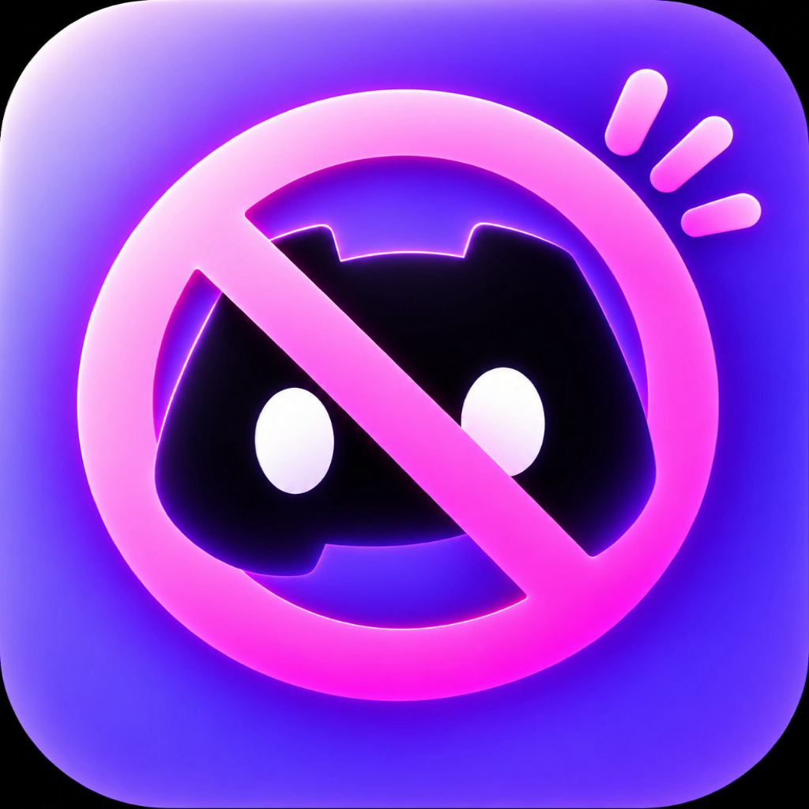
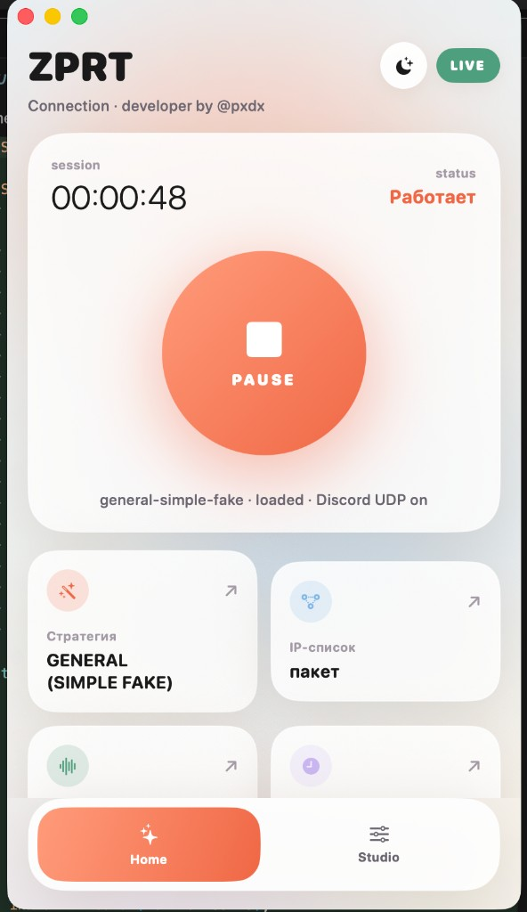

<div align="center">



# ZPRT Connection

**zapret-discord для macOS в один клик**

Локальный обход DPI для Discord и YouTube без VPN.<br>
Готовое приложение с движком внутри: нажали **GO**, ввели пароль один раз, и всё работает.

[](https://github.com/pxdxx/ZPRT-Connection-MAC-OS-Zapret-Discord/releases/latest)
[](LICENSE)
[](#скачать)
[](https://github.com/pxdxx/ZPRT-Connection-MAC-OS-Zapret-Discord/actions/workflows/build.yml)

[](https://github.com/pxdxx/ZPRT-Connection-MAC-OS-Zapret-Discord/releases/latest)
[](https://github.com/pxdxx/ZPRT-Connection-MAC-OS-Zapret-Discord/stargazers)
[](#статистика)
[](https://github.com/pxdxx/ZPRT-Connection-MAC-OS-Zapret-Discord/releases)

<a href="https://github.com/pxdxx/ZPRT-Connection-MAC-OS-Zapret-Discord/releases/latest/download/ZPRT-Connection-macOS.dmg">
  
</a>

[Скачать](#скачать) · [Возможности](#возможности) · [Статистика](#статистика) · [Как это устроено](#как-это-устроено) · [Сборка](#сборка-из-исходников) · [Ограничения](#ограничения)

</div>

<p align="center">
  
</p>

## Зачем это нужно

Провайдеры режут Discord и YouTube через DPI. VPN не всегда нужен: достаточно локального обхода, как у [zapret-discord-youtube](https://github.com/Flowseal/zapret-discord-youtube) на Windows.

На Mac обычный Zapret почти нереально поставить «из коробки»: нет удобного установщика, куча ручной возни с PF и скриптами, а часть Windows/Linux-сборок на macOS просто не ставится. Этот проект закрывает дыру: приложение сразу содержит движок и настроенный Discord-профиль.

## Возможности

- **Установка одним нажатием.** Кнопка **GO** ставит и запускает движок, пароль администратора нужен один раз.
- **Discord из коробки.** Домены Discord уже в списке, голос (UDP-порты) включён по умолчанию, стратегия `general-simple-fake`.
- **21 стратегия обхода** из [Flowseal/zapret-discord-youtube](https://github.com/Flowseal/zapret-discord-youtube), от `general` до `ALT13`. Списки доменов и IP синхронизированы с апстримом.
- **Быстрое добавление платформ.** YouTube, Instagram, Facebook, X, LinkedIn, Pinterest, Twitch, Spotify, WhatsApp, Signal, TikTok, Viber, Notion с фирменными иконками. Домены добавляются к вашему списку, ничего не стирая, повторный клик убирает их.
- **Свои домены** и режимы IP-списков (пакетный, расширенный, выключен).
- **Discord UDP и блокировка QUIC** включаются переключателями.
- **Быстрый отказ от заблокированных IP.** Пока обход работает, системный TCP keepinit снижается с ~75 до 7 секунд и возвращается обратно при остановке.
- **Апдейтер Discord** включается и выключается одной кнопкой, состояние определяется по факту.
- **Диагностика** с предпросмотром: версия, статус, стратегия, WAN и хвост лога движка, одним нажатием в буфер.
- **Уведомление о новой версии** с переходом на страницу релиза.
- Светлая и тёмная тема, иконка в меню, окно можно закрыть без выхода.
- Работает **без платной подписки Apple Developer**.

## Скачать

Готовые сборки лежат на странице [Releases](https://github.com/pxdxx/ZPRT-Connection-MAC-OS-Zapret-Discord/releases/latest).

| Система | Файл |
| --- | --- |
| macOS 14 и новее, Apple Silicon и Intel | `ZPRT-Connection-macOS.dmg` |

1. Скачайте `ZPRT-Connection-macOS.dmg`.
2. Откройте DMG и перетащите `ZPRT Connection.app` в **Программы**.
3. Запустите приложение (если macOS блокирует, см. ниже).
4. Нажмите **GO** и один раз введите пароль администратора.
5. Повторно ставить движок после перезапуска не нужно.

### Обход блокировки Gatekeeper

Приложение не подписано платным сертификатом Apple Developer, поэтому при первом запуске macOS его блокирует. Это нормально, чинится один раз:

1. При первом запуске появится окно с кнопками **«В корзину»** и **«Отмена»**. Нажмите **«Отмена»**, чтобы закрыть окно.
2. Откройте **Системные настройки → Конфиденциальность и безопасность**.
3. Пролистайте страницу в самый низ.
4. Нажмите кнопку **«Всё равно открыть»** и подтвердите запуск.
5. Дальше приложение открывается как обычно, без повторных предупреждений.

Если система пишет, что приложение повреждено, выполните в Терминале:

```bash
xattr -cr "/Applications/ZPRT Connection.app"
```

## Статистика

<div align="center">


</div>

<sub>Крупные счётчики в шапке: скачивания берутся из GitHub Releases и считают каждую загрузку файла, а не уникальных людей. Просмотры и уникальные посетители за последние 14 дней берутся из официальной статистики GitHub (Traffic) и обновляются раз в сутки.</sub>

## Как это устроено

| | |
| --- | --- |
| Интерфейс | SwiftUI, macOS 14+ |
| Движок | `utunws` на базе nfqws из [bol-van/zapret](https://github.com/bol-van/zapret), трафик заворачивается через PF и интерфейс `utun` |
| Стратегии и списки | из [Flowseal/zapret-discord-youtube](https://github.com/Flowseal/zapret-discord-youtube) |
| Сервис | LaunchDaemon, запускается один раз с паролем администратора |
| Привилегии | после инициализации движок сбрасывает права до `nobody` |

Обход привязан к физическому сетевому интерфейсу (`en*`), поэтому корпоративный VPN и split-tunnel не затрагиваются.

```
.
├── dsffdssd/
│   ├── App/             делегат приложения, иконка в меню
│   ├── Engine/          установка, запуск и остановка движка, проверка версии
│   ├── State/           состояние приложения и модели
│   ├── Views/           экраны Home и Studio, окна платформ и диагностики
│   └── Resources/engine/  скрипты, стратегии, списки, бинарник utunws
├── scripts/             сборка DMG
├── docs/                иконка и скриншот
└── .github/workflows/   проверочная сборка в GitHub Actions
```

## Сборка из исходников

### Xcode

1. Клонируйте репозиторий.
2. Откройте `dsffdssd.xcodeproj` в Xcode 26 или новее (проект собирается с Swift 6.2 и изоляцией по умолчанию `MainActor`).
3. Схема `dsffdssd`, назначение **My Mac**.
4. Signing: **Sign to Run Locally** (уже настроено).
5. Product → Run.

### Терминал

```bash
xcodebuild \
  -project dsffdssd.xcodeproj \
  -scheme dsffdssd \
  -configuration Release \
  -derivedDataPath /tmp/ZPRTBuild \
  CODE_SIGN_IDENTITY="-" \
  CODE_SIGNING_ALLOWED=YES \
  build

open "/tmp/ZPRTBuild/Build/Products/Release/ZPRT Connection.app"
```

Сборка DMG для релиза:

```bash
./scripts/package-release.sh
# результат: dist/ZPRT-Connection-macOS.dmg
```

> Не собирайте DerivedData на Desktop или в iCloud: расширенные атрибуты ломают codesign. Используйте `/tmp/...`.

## Ограничения

- Сборки **не имеют платной подписи Apple**, поэтому при первом запуске нужен обход Gatekeeper (см. выше).
- Приложение меняет системные настройки на время работы: правила PF и значение `net.inet.tcp.keepinit`. При остановке движка всё возвращается обратно. Быстрый keepinit можно выключить в настройках.
- Переключатель апдейтера Discord меняет права доступа к `Discord.app`, включить обратно можно той же кнопкой.
- Это **неофициальный** проект, он не связан с Discord и не одобрен этой компанией. Обход зависит от того, как именно провайдер фильтрует трафик, поэтому подойти может не каждая стратегия.
- Автообновления нет: приложение только сообщает о новой версии и открывает страницу релиза.

## Участие

Замечания и пулреквесты приветствуются. Если что-то не работает, откройте [issue](https://github.com/pxdxx/ZPRT-Connection-MAC-OS-Zapret-Discord/issues) и приложите текст из окна **Диагностика** в Studio: версию, стратегию и хвост лога сильно ускоряют разбор.

## Благодарности

- [bol-van/zapret](https://github.com/bol-van/zapret) за сам движок обхода.
- [Flowseal/zapret-discord-youtube](https://github.com/Flowseal/zapret-discord-youtube) за стратегии и списки.
- [Flowseal/zapret-mac-discord-youtube](https://github.com/Flowseal/zapret-mac-discord-youtube) за идеи по macOS-порту.
- [Simple Icons](https://simpleicons.org) за иконки платформ.

## Связь

- Telegram: [@pxdxz](https://t.me/pxdxz)

## Лицензия

[MIT](LICENSE) © 2026 pxdx. Сторонние компоненты сохраняют свои лицензии, подробности в файле [LICENSE](LICENSE).

## Disclaimer

Используйте в соответствии с законодательством вашей страны. Автор не несёт ответственности за неправомерное применение.

<sub>Zapret Discord Mac запрет дискорд macos zapret-discord для macOS запрет дискорд мак ос</sub>
